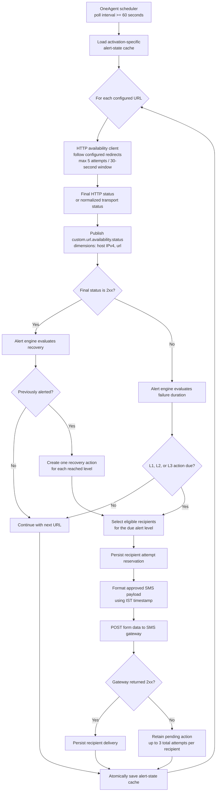

# URL SMS Plugin

The URL SMS Plugin is a local Dynatrace OneAgent extension that monitors a
configured list of HTTP(S) URLs. It publishes the final availability result for
every URL and uses time-based escalation to determine when an unavailable URL
requires notification. A URL is healthy when its final HTTP status is in the
`2xx` range.

## Architecture

```text
Configured URLs
    -> URL availability client
    -> HTTP status metric (host IP, URL)
    -> alert-state engine and durable cache
    -> SMS formatter and gateway client
    -> configured recipients
```

The extension runs where OneAgent runs. It is not a remote ActiveGate
extension.

## Low-level design



The cache file is written atomically in Dynatrace's configuration-specific
working directory. Its filename includes a hash of the activation ID, so
separate monitoring configurations remain isolated on the same OneAgent host.

## Prerequisites

- Dynatrace OneAgent with support for Python extensions.
- Python 3.10 or later in the extension runtime.
- Network access from the OneAgent host to monitored URLs and the SMS gateway.
- An SMS gateway URL, username, password, and JSESSIONID value.
- A signed extension package and its trusted root certificate.

## Certificate trust and deployment

The extension ZIP must be signed, and its **root certificate** must be trusted
by both the Dynatrace environment and every OneAgent host that will run this
local extension.

1. Add the root certificate to the Dynatrace Credential Vault as a **Public
   certificate** with the **Extension validation** scope.
2. On each Linux OneAgent host, place the root certificate as `root.pem` in:

   ```text
   /var/lib/dynatrace/oneagent/agent/config/certificates/
   ```

   The file must be readable by `dtuser`. Do not copy the private key to the
   OneAgent host.
3. Upload the signed extension ZIP to Dynatrace, then create a local monitoring
   configuration for the intended OneAgent hosts or host group.

On Windows, the equivalent certificate directory is:

```text
%PROGRAMDATA%\dynatrace\oneagent\agent\config\certificates\
```

If certificate permissions are corrected after a failed activation, restart the
Extension Execution Controller before retrying. Dynatrace documents the root
certificate paths and `dtuser` read-access requirement in its
[extension-signing guide](https://docs.dynatrace.com/docs/ingest-from/extensions/develop-your-extensions/sign-extensions).

## Configuration

Configure the extension through local activation configuration. Keep the
password and JSESSIONID in Dynatrace secret fields; do not commit real values.

### Activation steps

1. In Dynatrace, open **Extensions**, select **URL SMS Plugin**, and add or edit
   a local monitoring configuration.
2. Select the OneAgent hosts or host group that should perform the URL checks.
3. Enter the application name. It is included in the `Incident` field of every
   SMS alert for this monitoring configuration.
4. Add each target as a complete URL, including its scheme. For example,
   `https://www.google.com`; `www.google.com` is not a valid HTTP client URL.
5. Configure L1, L2, and L3 recipient lists and increasing L2/L3 delays.
6. Set a polling interval of 60 seconds or more, redirect limit, and cache
   retention period.
7. Provide the SMS endpoint, username, password, and JSESSIONID. Keep **Dry
   Run** enabled for the first verification; it creates alert decisions without
   sending SMS.
8. Verify the configuration's **Health** tab and OneAgent logs. Disable Dry Run
   only after confirming the monitored URLs and SMS endpoint are reachable.

| Setting | Description |
| --- | --- |
| Application Name | Application identifier used in the SMS incident line. |
| URLs to Monitor | One or more unique complete `http://` or `https://` URLs. |
| L1, L2, L3 Recipients | Recipient numbers for initial and escalating alerts. |
| L2/L3 Criticality Delay | Continuous-failure minutes before L2/L3 applies. L3 must exceed L2. |
| Polling Interval | URL-check interval in seconds; minimum 60 seconds. |
| Maximum Redirects | Maximum redirects followed during one URL check. |
| Cache Retention | Minutes to retain recovered or removed-URL alert state. |
| SMS API URL / Username | SMS gateway endpoint and user name. |
| SMS API Password / JSESSIONID | Gateway secrets. |
| Dry Run | Logs notification delivery rather than sending it. |

## URL checks and metric

Each URL is checked up to five times within a 30-second retry window. The final
result is reported as the gauge metric:

```text
custom.url.availability.status
```

Dimensions are `host` (the active IPv4 address of the OneAgent host) and `url`
(the configured URL). If no usable host address can be resolved, `host` is
`127.0.0.1`. The metric value is the final HTTP status or a normalized transport
status:

| Value | Meaning |
| --- | --- |
| `-1` | TLS/certificate failure |
| `-2` | Timeout |
| `-3` | Connection failure |
| `-4` | Redirect limit or loop |
| `-5` | Other request failure |

## Alert lifecycle

A continuous non-`2xx` result creates an L1 alert action, then L2 and L3
actions only when their configured delays are reached. Alerts are not repeated
at the same level. A later `2xx` result creates one issue-resolution action for
every escalation level reached.

State is written atomically in the Dynatrace configuration-specific extension
working directory. The activation ID is also hashed into the cache filename for
isolation, and state is retained according to the configured retention period.
Failure, escalation, and recovery timestamps use Indian Standard Time
(`Asia/Kolkata`, IST); escalation delays use elapsed time.

## SMS gateway contract

The SMS transport will submit a form-encoded `POST` request with:

- `Content-Type: application/x-www-form-urlencoded`
- `Cookie: JSESSIONID=<configured cookie ID>`
- `auth`: JSON containing configured username/password and `appName: Ecamptest`
- `jsonString`: JSON containing campaign `AppDynamics` and the recipient number

The message payload is:

```text
Incident: <application name> URL Monitoring [<alert level>]
URL: <configured URL>
Status: <HTTP or normalized status>
Time: <IST timestamp>
DT
```

Each recipient has up to three total submission attempts for an action. Attempt
reservations and confirmed deliveries are persisted per activation, so a restart
does not resend to recipients already confirmed by the gateway.

The gateway connection timeout is five seconds, with a ten-second total request
timeout. A successful HTTP response is sufficient; the response body is not
waited on.

## Security

- Treat password and JSESSIONID values as secrets.
- Never log gateway credentials, cookies, or authorization payloads.
- Use dummy credentials only with the local mock gateway.

## Troubleshooting

- A metric-ingestion error for a dimension key means the deployed package is
  outdated. This version emits lowercase `host` and `url` dimension keys.
- A `request` status of `-5` for a hostname such as `www.google.com` usually
  means the configured URL is missing `http://` or `https://`.
- The cache must be created in the Dynatrace working directory. Do not override
  it with an unwritable home-directory path such as `/home/dtuser/.local`.
- On a host where the mock SMS server and OneAgent run together, use
  `http://localhost:3000/sms`. From a different host, use the mock VM's
  reachable IP address or DNS name instead of `localhost`.
